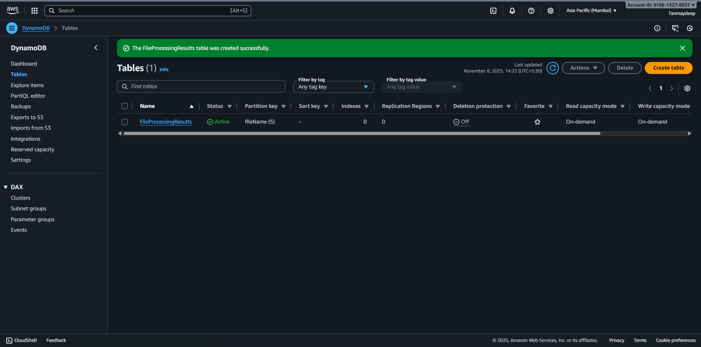
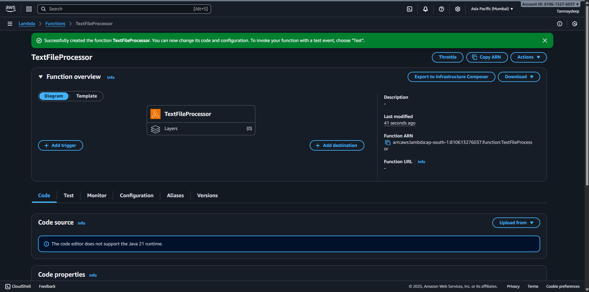
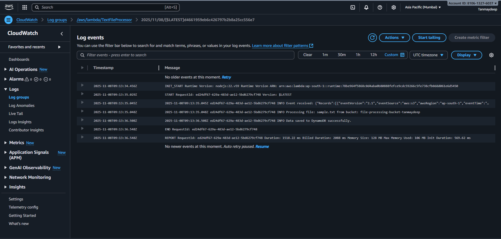
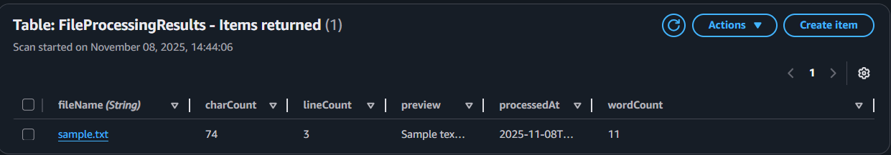

# 🧠 AWS Case Study 1 — S3 File Processing with Lambda and DynamoDB

This project demonstrates how to build an **automated text file processing system** using **AWS Lambda**, **S3**, and **DynamoDB**.  
Whenever a `.txt` file is uploaded to an S3 bucket, the **Lambda function** is triggered to:
- Read the file contents,
- Count **lines**, **words**, and **characters**,
- Extract a **100-character preview**, and
- Store the processing results in a **DynamoDB table**.

---

## 🧩 Project Overview

| Component | Description |
|------------|-------------|
| **S3 Bucket** | Stores uploaded `.txt` files |
| **Lambda Function** | Processes text files and sends results to DynamoDB |
| **DynamoDB Table** | Stores file analysis results |
| **CloudWatch Logs** | Logs execution details and errors |

---

## 📁 Architecture Flow

1. User uploads a text file (`.txt`) to S3.
2. The **S3 Event Trigger** invokes the **Lambda function**.
3. Lambda reads the file from S3 using the AWS SDK.
4. Lambda counts lines, words, and characters, and extracts a preview.
5. Lambda stores results in **DynamoDB**.
6. Logs are written to **CloudWatch** for monitoring.

---

## ⚙️ Step-by-Step Setup Guide

### **Step 1: Create S3 Bucket**
1. Go to **AWS Console → S3 → Create Bucket**.
2. Name it: `file-processing-bucket-<your-name>`.
3. Keep all default settings and create the bucket.

 


### **Step 2: Configure S3 Event Notification**
1. Open your S3 bucket → **Properties** → scroll to **Event Notifications**.
2. Click **Create event notification**:
   - Name: `LambdaTriggerEvent`
   - Event type: `All object create events`
   - Suffix filter: `.txt`
   - Destination: Lambda function (`TextFileProcessor`)
3. Save changes.

  


---

### **Step 3: Create DynamoDB Table**
1. Go to **DynamoDB → Create table**.
2. Table name: `FileProcessingResults`
3. Partition key: `fileName (String)`
4. Click **Create Table**.

 


---

### **Step 4: Create the Lambda Function**

#### **Option 1: Node.js Version**
If you prefer Node.js 22 runtime, use the following code:

  
   


```javascript
import { S3Client, GetObjectCommand } from "@aws-sdk/client-s3";
import { DynamoDBClient, PutItemCommand } from "@aws-sdk/client-dynamodb";
import { Readable } from "stream";

const s3 = new S3Client();
const dynamo = new DynamoDBClient();

export const handler = async (event) => {
  console.log("Event received:", JSON.stringify(event));

  try {
    // 1. Get bucket and key from S3 event
    const record = event.Records[0];
    const bucket = record.s3.bucket.name;
    const key = decodeURIComponent(record.s3.object.key.replace(/\+/g, " "));

    console.log(`Processing file: ${key} from bucket: ${bucket}`);

    // 2. Get file content from S3
    const getObjectCommand = new GetObjectCommand({ Bucket: bucket, Key: key });
    const response = await s3.send(getObjectCommand);

    // Convert stream to text
    const streamToString = (stream) =>
      new Promise((resolve, reject) => {
        const chunks = [];
        stream.on("data", (chunk) => chunks.push(chunk));
        stream.on("error", reject);
        stream.on("end", () => resolve(Buffer.concat(chunks).toString("utf-8")));
      });

    const fileContent = await streamToString(response.Body);

    // 3. Process text: count lines, words, characters
    const lineCount = fileContent.split(/\r?\n/).length;
    const wordCount = fileContent.trim().split(/\s+/).length;
    const charCount = fileContent.length;
    const preview = fileContent.slice(0, 100);

    // 4. Store results in DynamoDB
    const putItemCommand = new PutItemCommand({
      TableName: "FileProcessingResults",
      Item: {
        fileName: { S: key },
        lineCount: { N: lineCount.toString() },
        wordCount: { N: wordCount.toString() },
        charCount: { N: charCount.toString() },
        preview: { S: preview },
        processedAt: { S: new Date().toISOString() },
      },
    });

    await dynamo.send(putItemCommand);
    console.log("Data saved to DynamoDB successfully.");

    return {
      statusCode: 200,
      body: JSON.stringify({
        message: "File processed successfully",
        fileName: key,
        lineCount,
        wordCount,
        charCount,
      }),
    };
  } catch (error) {
    console.error("Error processing file:", error);
    throw error;
  }
};

```
### **Step 5: Test the Setup**

Upload a file named sample.txt to your S3 bucket.

Wait for the Lambda to trigger automatically.

Check:

CloudWatch Logs → to verify execution success.

DynamoDB → new entry created with file statistics.

### **Step 6: Result**

)
  
 
